# 🌳 Branching Strategy Visualization

## Branch Flow Diagram

```
┌─────────────────────────────────────────────────────────────┐
│                     FEATURE DEVELOPMENT                      │
└─────────────────────────────────────────────────────────────┘
                              │
                    feature/new-feature
                              │
                              ▼
┌─────────────────────────────────────────────────────────────┐
│                   DEV (Development) 🔧                       │
│  • Active development                                        │
│  • Feature integration                                       │
│  • Continuous deployment                                     │
│  • Automated: Lint → Build → Test → Deploy Preview          │
└─────────────────────────────────────────────────────────────┘
                              │
                              │ (PR with approval)
                              ▼
┌─────────────────────────────────────────────────────────────┐
│                  STAGE (Staging) 🎭                          │
│  • Pre-production testing                                    │
│  • Integration testing                                       │
│  • UAT environment                                           │
│  • Automated: Security Scan → Integration Tests → Deploy    │
└─────────────────────────────────────────────────────────────┘
                              │
                              │ (PR with 2+ approvals)
                              ▼
┌─────────────────────────────────────────────────────────────┐
│                   PROD (Production) 🚀                       │
│  • Live production site                                      │
│  • GitHub Pages deployment                                   │
│  • Requires manual approval                                  │
│  • URL: https://evgenygurin.github.io/agent-boss/           │
└─────────────────────────────────────────────────────────────┘
```

## Workflow States

### 🟢 Development (dev)
- **Purpose**: Active development and feature integration
- **Deployment**: Automatic on every push
- **Protection**: PR required, 1 approval
- **CI/CD**: 
  - ✅ Lint & Validation
  - ✅ Build & Test
  - ✅ Deploy Preview

### 🔵 Staging (stage)
- **Purpose**: Pre-production validation
- **Deployment**: Automatic on merge from dev
- **Protection**: PR required, 1 approval, status checks
- **CI/CD**:
  - 🔒 Security Scan
  - 🧪 Integration Tests
  - 🚀 Deploy to Staging
  - 💨 Smoke Tests

### 🔴 Production (prod)
- **Purpose**: Live production environment
- **Deployment**: Automatic on merge from stage
- **Protection**: PR required, 2+ approvals, signed commits
- **CI/CD**:
  - 🚀 Deploy to GitHub Pages
  - 📊 Deployment Summary

## Hotfix Flow

```
┌─────────────────────────────────────────────────────────────┐
│                         PROD 🔴                              │
└─────────────────────────────────────────────────────────────┘
                              │
                    hotfix/critical-fix
                              │
                              ▼
┌─────────────────────────────────────────────────────────────┐
│                  FIX & DEPLOY TO PROD                        │
└─────────────────────────────────────────────────────────────┘
                              │
                              ├──────────────┐
                              ▼              ▼
                           STAGE           DEV
                    (backport merge) (backport merge)
```

## Branch Comparison

| Feature | Dev | Stage | Prod |
|---------|-----|-------|------|
| Auto-deploy | ✅ | ✅ | ✅ |
| Required approvals | 1 | 1 | 2+ |
| Status checks | ✅ | ✅ | ✅ |
| Security scan | ❌ | ✅ | ✅ |
| Integration tests | ❌ | ✅ | ✅ |
| Signed commits | ❌ | ❌ | ✅ |
| Public URL | Preview | Staging | **Production** |
| Deployment frequency | Many/day | Daily | Weekly |

## Deployment Timeline

```
Day 1:
├─ Feature A → dev ─────┐
├─ Feature B → dev ─────┤
└─ Feature C → dev ─────┘
                        │
Day 2:                  │
                        └─→ dev → stage (Integration testing)
                                    │
Day 3:                              │
                                    └─→ stage → prod (Production release)
```

## CI/CD Pipeline Flow

```mermaid
graph LR
    A[Developer] -->|Push| B[Feature Branch]
    B -->|PR| C[Dev Branch]
    C -->|Auto CI/CD| D[Dev Deploy]
    D -->|Tests Pass| E[Ready for Stage]
    E -->|PR| F[Stage Branch]
    F -->|Auto CI/CD| G[Stage Deploy]
    G -->|Validation| H[Ready for Prod]
    H -->|PR + Approval| I[Prod Branch]
    I -->|Auto Deploy| J[Production Live]
```



## Real-World Example

### Monday: Development
```bash
git checkout dev
git checkout -b feature/user-auth
# ... develop ...
git push origin feature/user-auth
# Create PR to dev → Merge → Auto-deploy to dev
```

### Tuesday: Staging
```bash
git checkout stage
git checkout -b promote/dev-to-stage
git merge dev
git push origin promote/dev-to-stage
# Create PR to stage → Approve → Auto-deploy to staging
# QA team tests on staging
```

### Wednesday: Production (if all good)
```bash
git checkout prod
git checkout -b release/v1.2.0
git merge stage
git push origin release/v1.2.0
# Create PR to prod → 2 Approvals → Auto-deploy to production
# Monitor production deployment
```

## Best Practices Summary

✅ **DO:**
- Create feature branches from `dev`
- Follow PR templates
- Wait for CI/CD checks
- Test in staging before production
- Document breaking changes
- Use conventional commits

❌ **DON'T:**
- Push directly to protected branches
- Skip CI/CD checks
- Merge without approval
- Deploy without testing
- Ignore failed tests
- Bypass branch protection

## Metrics & Monitoring

### Development
- **Deploy frequency**: Multiple times per day
- **Lead time**: < 1 hour
- **Failure rate**: Low impact (development only)

### Staging
- **Deploy frequency**: 1-2 times per day
- **Lead time**: < 4 hours
- **Test coverage**: 80%+

### Production
- **Deploy frequency**: 1-2 times per week
- **Lead time**: 1-3 days
- **Uptime target**: 99.9%
- **Rollback time**: < 5 minutes

---

**Maintained by**: DevOps Team  
**Last Updated**: 2024  
**Status**: ✅ Active & Deployed
